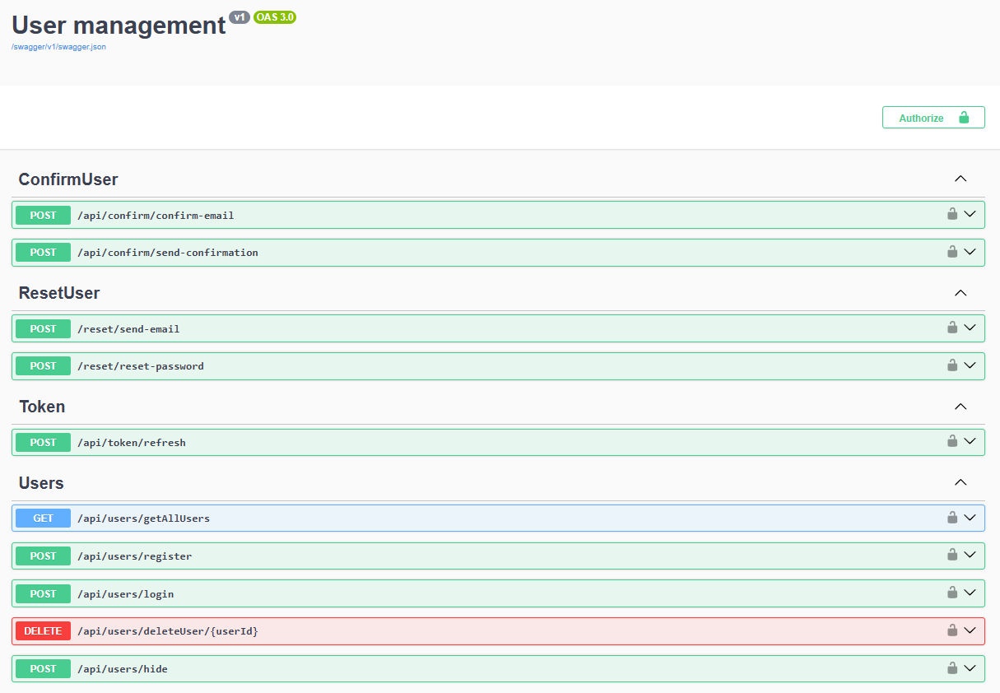
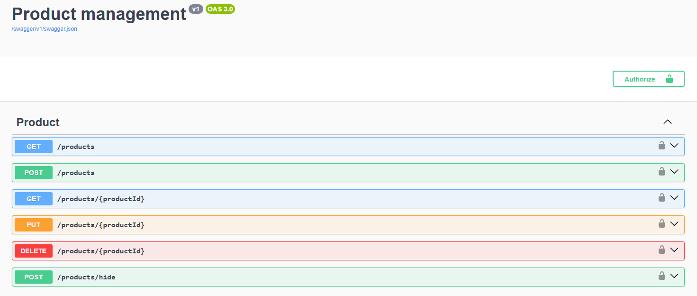

# Shop API


## Running the Application in Docker

This guide will help you set up and run the application using Docker.

### Prerequisites

[Docker](https://www.docker.com/get-started) installed on your machine.


### Steps to Run the Application

1. **Clone the Repository**

   Clone the repository to your local machine:

   ```bash
   git clone https://github.com/Vladislav8653/Shop
   
2. **Execute docker-compose up**

    Open terminal on the root of project and execute command:
    
    ```bash
    docker-compose up --build
   
3. Ready

    Now, you can access your application by navigating to the following URLs:
    
    - **Product management microservice**: [http://localhost:2000](http://localhost:2000)
    - **User management microservice**: [http://localhost:3000](http://localhost:3000)
    
    Enjoy the functionality of both microservices!


## Functionality
### User management microservice

Implements CRUD operations with user:
   - Registration user
   - Login user
   - Deleting user
   - Getting all users

Implements authentication and authorisation by JWT access token
   - Getting access token with different roles
   - Refreshing access token via refresh token

Implements account confirming via Email
   - Sends email to user with confirmation code

Implements password reset via Email
   - Sends email to user with recovering code

Support "soft-delete" operation with users
   - User can be deactivated and products won't be deleted 


##

### Product management microservice

Implements CRUD operations with product:
   - Create product
   - Update product
   - Delete product
   - Get all products
   - Get product by id

Support authentication and authorisation by JWT access token
   - Create, update and delete products can only authorized users
   - Update and delete products can only owner

Implements pagination, filtration and searching of products

Implement "soft-delete" operation with products
   - User can be deactivated and products will be marked as deactivated
   - User microservice send request after user deactivation and activation




